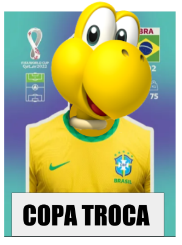
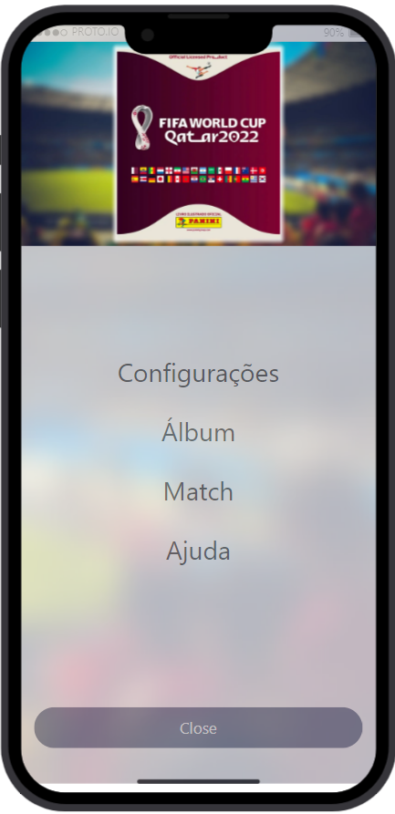
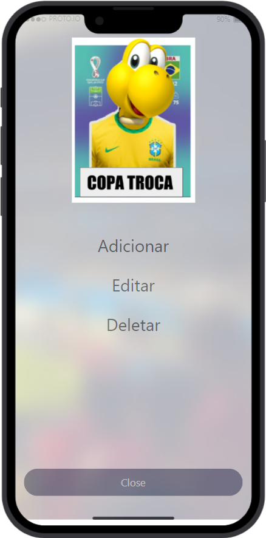
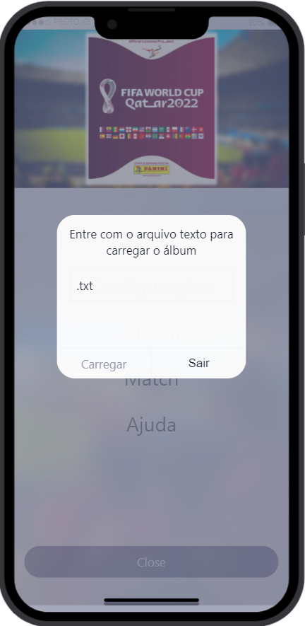
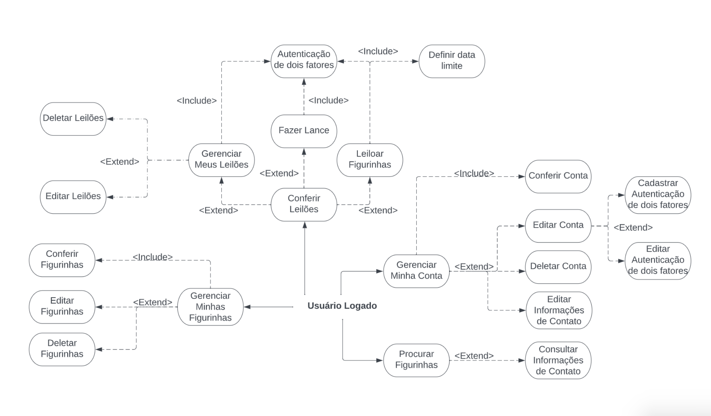

<h1>Copa Troca</h1>

## Description

Track your World Cup stickers!

Usually with the World Cup albums, you have to write down lists or print them out and highlight the ones you already have. This makes it hard to specifically see which stickers your friends are missing or have repeated since no one follows a common format. Also, you have to cross reference the list constantly when discussing new stickers or trying to set up a trade. This program fixes all those issues by providing a fast way to see which stickers you have, are missing, and have repeated. 

Setting up trades, sharing your lists, and managing the stickers is quick and easy on the **Copa Troca** tracker.

Built with .NET.

---

## Prototype for mobile application

### Screen 1 - MENU

### Screen 2 - ALBUM MENU

### Screen 3 - INPUT MENU

### Logged User

## Trello Board
- https://trello.com/b/IHrJVixr/cteds-copa
